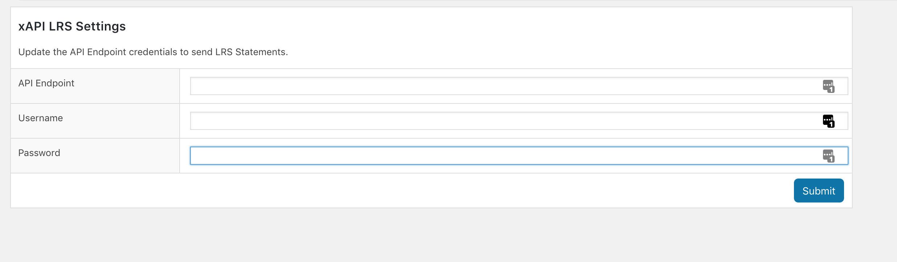
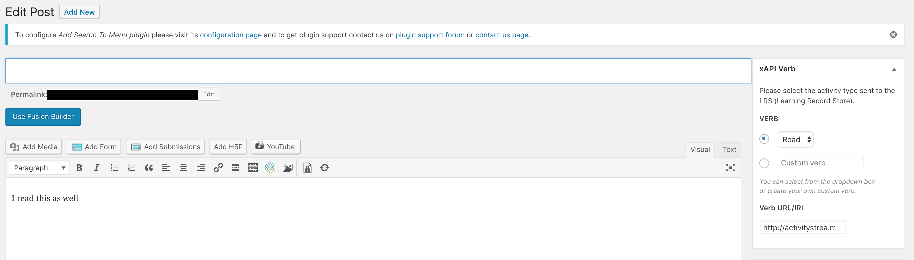

# Wordpress xAPI plugin

### Simple Wordpress plugin that sends an xAPI statement to an LRS (Learning Record Store) with the verb of your choice.

## Installation instructions.	

1. Download or Clone repo.
2. Open [/xapi_lrs_plugin](https://github.com/rolandbarrera/xAPI-Wordpress/tree/master/xapi_lrs_plugin)
3. Compress contents of [/xapi_lrs_plugin](https://github.com/rolandbarrera/xAPI-Wordpress/tree/master/xapi_lrs_plugin) to xapi_lrs.zip
4. Upload plugin (xapi_lrs.zip)to Wordpress admin plugin page, then activate it.
5. Connect plugin to LRS. Find "xAPI Settings"   
6. Fill in the blanks with your LRS details.  
7. Add or edit a page
8. Attach xAPI to page by filling in blanks.   
    * Fill in the blanks with the verb of your choice. I suggest adding a "Custom Verb" then add the verbs IRI in the field below.
8. Save post.
9. Visit page 
10.  Check your LRS for sucessful statement delivery.

Statement is sent as soon as a logged in user visits a page with the plugin attached. If post is public it will send Default "John Doe" info which you can edit to your org.

